# Migration Template

This repository provides an example of what the migration of a DaVinci Configurator 5 (DvCfg5) project can look like.

The steps described here do not represent a universal procedure for migrating any arbitrary DvCfg5 project. Some fundamental steps - such as tool or BSW package migration - can certainly be reused. However, additional or modified steps may be required depending on the specific project context.
In particular, the migration of the BSW package (SIP) from R34 to R35 is only initiated here. The actual migration still needs to be performed manually as before.

All steps mentioned here are described in more detail in the official tool documentation: [Documentation - DaVinci Configurator Classic 6](https://help.vector.com/davinci-configurator-classic/en/current/dvcfg-classic/6.2-SP0/index.html).

## 📦 What Does This Folder Contain?

- \_config.ps1: Sets the user-defined paths required for the migration.
- \_\_MasterWorkflow.ps1: Starts the overall migration workflow.

## 🧩 Migration Workflow

### High-Level Workflow

```mermaid
%%{init: {
"theme": "base",
"flowchart": {
  "htmlLabels": false,           /* Pfeile/Marker docken an die echte Box (SVG) */
  "wrap": true,                  /* automatischer Zeilenumbruch */
  "padding": 12,                 /* Innenabstand im Knoten */
  "arrowMarkerAbsolute": true    /* stabile Pfeilspitzen */
}
}}%%

flowchart LR
  classDef step fill:#B70032,stroke:#7a001f,stroke-width:2px,color:#FFFF;

  A["Tool Migration</br>(DaVinci Configurator, DaVinci Developer and vVirtualtarget)"]
  B["BSW-Package (SIP) Migration</br>R34 → R35"]
  C["Diagnostic Import"]
  D["Store User Code Blocks"]
  class A,B,C,D step;

  A --> B --> C --> D
```

## Tool Migration

The tool migration is divided into the migration of DaVinci Configurator 6 (DvCfg6), DaVinci Developer (DvDev), and vVIRTUALtarget (VTT).

In the context of DvDev, we refer more to a conversion rather than a migration. This conversion is necessary to prepare the entire project for the new interaction model between DvCfg6 and DvDev (see [Interactions with DaVinci Developer Classic](https://help.vector.com/davinci-configurator-classic/en/current/dvcfg-classic/6.2-SP0/migration/critical-changes.html#_interactions_with_davinci_developer_classic)). In the context of VTT, we refer to this step as an update (see [Update a vVIRTUALtarget Project or a VTTMAKE File](https://help.vector.com/vVIRTUALtarget/9.5/en/Help/Content/Topics/General/AUTOSARClassicECUs/vVIRTUALtargetMigrationDPAtoDVJSON.htm?Highlight=configurator%206)).

### DaVinci Configurator 6 Migration

see [Migrating Projects to DaVinci Configurator Classic Version 6](https://help.vector.com/davinci-configurator-classic/en/current/dvcfg-classic/6.2-SP0/migration/project-migration.html)

  After running the dvcfg_migration.ps1 script (which executes project-migration.exe), it is very important to check the DVCFG_migration.log for errors.
  To avoid follow‑up errors, these issues should be fixed whenever possible.
  In addition to the DVCFG_migration.log, the ModelMergeReport.sarif (located at Output\Log\ProjectLoad\) can also be very helpful.
  After fixing an error, a derive must be executed so that the tool becomes aware of the correction for subsequent steps.
  An example script is provided in the misc folder and must be executed separately from the MasterWorkflow.

### DaVinci Developer Conversation

see [Workspace Conversion](https://help.vector.com/davinci-developer-classic/current/en/help/html/index.html?page=workspace_conversion)

  The link refers to the newly created dvjson file inside the DCF.

### Migrate VTT Project

see [Update a vVIRTUALtarget Project or a VTTMAKE File](https://help.vector.com/vVIRTUALtarget/9.5/en/Help/Content/Topics/General/AUTOSARClassicECUs/vVIRTUALtargetMigrationDPAtoDVJSON.htm?Highlight=configurator%206)

This will create a VTT folder inside the Config directory. A backup file will also be created in the DvCfg5 project.

## BSW-Package (SIP) Migration

see [Migrating Project to Newer BSW Package](https://help.vector.com/davinci-configurator-classic/en/current/dvcfg-classic/6.2-SP0/migration/bsw-migration.html)

The migration is only triggered as part of the shown workflow. The well‑known SIP migration from previous releases still needs to be performed manually.

  
  The BSW package migration in the GUI works the same way as it did in DvCfg5.
  To enable the diagnostic import afterwards, the following steps must be executed:
  [BSW-Package migration 1](_images/sip_migration_1.png), [BSW-Package migration 2](_images/sip_migration_2.png) and [BSW-Package migration 3](_images/sip_migration_3.png). If in the following project load an error pops up, it is recommended to check the Output\Log\ProjectLoad\ModelMergeReport.sarif file. These errors are mostly merge errors caused by AUTOSAR elements being defined in multiple files.
  After completing these steps, the BSW package migration is triggered, and the next step in the workflow can be executed.

## Diagnostic Import

The diagnostic import workflow shown here is only an example. Other workflows - such as generating and converting the CDD file using the [DaVinci-AUTOSAR-JSON (DVARJSON)](https://help.vector.com/davinci-configurator-classic/en/current/davinci-autosar-json/6.2-SP0/index.html) - are also possible. Alternatively, these steps can be performed manually with the support of the [VS Code Extension](https://marketplace.visualstudio.com/items?itemName=VectorGroup.dvarjson). All these different methods ultimately achieve the same result.

The file_preprocessing_data.json file is generated by project-migration.exe.
It stores the preprocessed information of the DPA project. For example, the name of the ECU Instance used in the DvCfg5 project is stored there.
If the project contains variants, both the extraction of this information from the JSON file and the storage of it in the control file must be adapted accordingly.
Once these adjustments are made, the diagnostic import can also be executed for variant projects.

## Store User Code Blocks

see [Generate Source Files with Custom User Code Blocks](https://help.vector.com/davinci-configurator-classic/en/current/dvcfg-classic/6.2-SP0/generation/user-code-handling.html)

  Starting with DvCfg6, user code blocks are no longer managed automatically during source file generation. Instead, you now have full control through the DaVinci User Code Tool (DvUCT).
  Storing the UCBs is only one part of the process. For the actual usage of user code after code generation, it is also necessary to restore the UCBs afterwards.

## 🚀 Getting Started with DaVinci_WorkspaceSetup.bat

1. Set the workspace‑ and user‑specific variables in \_config.ps1.
2. Run the \_\_MasterWorkflow.ps1 script in PowerShell.
3. Go through the workflow step by step by entering the ID of the required step.

### **Important**

- Steps that are not needed can be skipped.
- Changing the execution order of steps may cause errors in the workflow.
- Steps can be marked as not completed again by entering the ID of a step that has already been completed.
- in \_config.ps1 it is expected that he DCF has the same name as the DPA/DVJSON

## What project can be migrated directly with this template?

- a DvCfg5 project that uses a DaVinci Developer Classic workspace
- a DvCfg5 project that does not use a DaVinci Developer Classic workspace
- a DvCfg5 project that uses vVIRTUALtarget
- a DvCfg5 project that does not use vVIRTUALtarget
- a DvCfg5 project that uses a CDD file for the diagnostic modules
- a DvCfg5 project that uses no diagnostic modules

For other kind of projects these steps need to be adapted individual or further steps need to be added.

## Requirements

- [DaVinci Configurator Version 6.2.1](https://www.vector.com/de/de/download/davinci-configurator-classic-6-2-1/) or higher
- [DaVinci Developer Version 4.17 (SP2)](https://www.vector.com/de/de/download/davinci-developer-classic-4-17-45-sp2/) or higher
- [vVIRTUALtarget 9 (SP5)](https://www.vector.com/de/de/download/vvirtualtarget-windows-9-sp5/) or higher
- R35 BSW package
- Diagnostic file is a CDD (for ODX-based projects, only the diagnostic import step needs to be adapted)
- Invariant project (for variant projects, only the diagnostic import step needs to be adapted)
